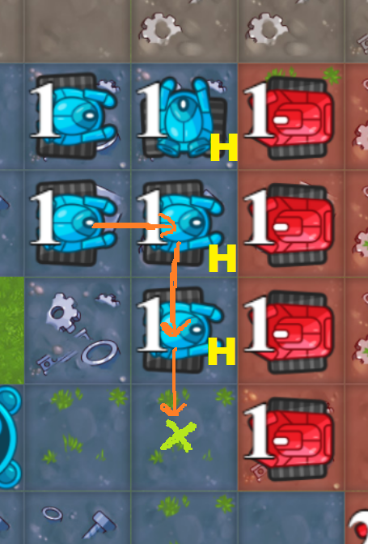

# Codingame Fall Challenge 2022 (delineate)

This is an overview of my approach to the Codingame Fall Challenge 2022 where I finished in first place. Thanks to Codingame and all the other competitors for such a fun and challenging competition.

I'll start with an overview of what I think were the most important pieces, and then mention a bunch of other details.

## Movement

Breadth-first search (BFS) from all my robots until reaching a "boundary" cell. Then remove that robot from the list and repeat for my remaining robots. Each time a boundary cell is targeted, I artificially raise its cost (i.e. pretend that it's further away).  This gives one parameter to balance speed vs diversity of targets. Specifically I used 5.0*height/12.0 which worked best in testing.

Using this approach, I also added other factors to adjust the costs of every cell/target (more details at the end).

## Arena testing

As with most competitions, I found having a local arena to test changes to be absolutely critical. Instead of reimplementing the map generator in C++ (which looked to be very non-trivial), I used the game's source code (via cg-brutaltester) to generate a set of 20,000 maps which would be my reference set. I saw a very strong correlation between arena improvements and leaderboard improvements.

## Defense
Each turn, I look at all boundary cells that might be attacked (*cells_to_defend*). This becomes an interesting graph-theory type problem (using directed edges for potential robot movements). I added the idea of a *HoldRobot* move internally to make planning/accounting easier.

I sort the *cells_to_defend* by a variety of factors (mostly # of my squares, neutral squares, and opponent squares) and then go down the list defending as many cells as possible.

There are a variety of tricks I can use to change previous plans without needing to spawn new robots. For example:

The initial plan was to defend 3 squares (H) by holding robots and now I have to try to defend the green X. I can satisfy the request by finding a path of held robots leading to a free robot and then modifying the plan accordingly. There are a lot of different tricks like this (inverting edges, etc).

I usually defend an empty square with a recycler but will defend with units under some conditions (have enough money to defend via spawning and the "net squares" lost by building the recycler is too negative or I have a big advantage in army value (# robots + money + future_income)).

## Money vs Squares
Modeling the relationship between "more money" vs "more squares" was very important and I found big arena performance differences from small tweaks to this part of the code. I started with some simple fixed model and then ran a bunch of experiments on toy maps (plain X by Y rectangles) where the players start in the top and bottom rows, one with 10 money and the other with money ranging from 10 to 200.

Each line represents a different width. For example, if the map is only 1-wide, then even a huge army advantage will add only 2.5 squares on average (2 if the distance is odd, 3 if the distance is even). The final model used:
 - difference in army values
 - number of boundary squares
 - distance to the opponent

I build an income recycler when it's a net gain to my score (*squares_gained_from_extra_money - my_squares_lost + opponent_squares_lost*).

## The Boundary

Figuring out the boundary_cells and boundary_size is more nuanced than it first seems.
For every square, I figure out how many turns it would take each player to get a robot there.  So my squares already containing a robot start at distance 0 and my empty squares start at distance 1.

My boundary cells are cells that satisfy either of the following:
- non-opponent cells (cells not closest to the opponent) that are next to opponent cells
- contested cells next to my cells

An example of blue's boundary cells:

For calculating the size of the boundary (which I use in the money-vs-squares model among other places), I use the number of boundary_cells but then only give fractional weight to cells that have limited lifespans (or whose neighbors all have limited lifespans).

## Other details

Some other factors in the movement BFS:
 - prefer targets with a high number of healthy neighbors (cells which won't die in the future)
 - prefer high point differential targets (comparing if I were to own it vs if my opponent owned it)
 - prefer exploring new squares (squares that otherwise would stay neutral without this path)
 - prefer extending my army's north-south range
 - prefer good future recycler locations (that are currently neutral)
 - avoid good future recycler locations (that I own already)

Other miscellaneous improvements:
 - add random noise for each cell's cost in the movement BFS searches, and then repeat (20-30 times) to find the best set of paths
 - in the early game, simulate the entire turn and the next 2 turns, and then remove loops and other inefficient movements
 - lots of endgame scenarios (especially when the boundary is down to 1-wide)
 - handle all the edge cases carefully! (there are so many edge cases in this game, especially around single cells or near expiring cells and I kept coming across surprising new ones even on the last day)
 - create synthetic demands in the "defense" section for high value moves (usually when pushing/extending along the border in a race with the opponent)
 - add backup moves for each robot when the move could "fail" (i.e. when an opponent builds a recycler there and my robot happens to stay in the same cell)

## Overall Turn summary

Putting it all together, a turn looks like the following:

 1. check endgame scenarios
 2. satisfy the defense requirements/synthetic demands as much as possible
 3. use excess robots on the boundary to attack (also use some held robots to attack in certain cases)
 4. build an income recycler if I can and it's net positive
 5. movement bfs for all robots (run multiple time with random noise)
 6. a similar movement bfs to figure out where to spawn new robots
 7. do another movement bfs for any robots that are newly available (for example, if I spawn a robot in a location that previously held a robot for defense, there is now a free robot to move)
 8. (in the early game) simulate the next 2 moves as well and then adjust the current turn moves accordingly
